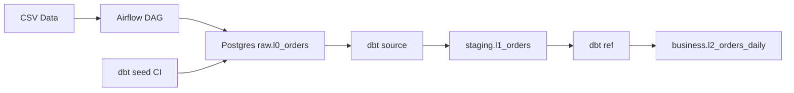

# Data Engineering Portfolio

Production-style data pipeline with dbt, Postgres, and CI validation.

This repository contains hands-on data engineering projects built with open-source tools and production-style design patterns.

## Current project: Batch pipeline for retail orders

This project implements a layered batch data pipeline using Airflow, PostgreSQL, Python, and dbt. It follows a medallion-style architecture (raw → staging → business) and includes CI validation using GitHub Actions.

### Architecture

- **Ingestion / orchestration:** Airflow  
- **Storage:** PostgreSQL  
- **Transformation:** dbt  
- **Containerization:** Docker  
- **CI/CD:** GitHub Actions  




### Layered data model

- **raw.l0_orders**  
  Raw ingested source data loaded from CSV through an Airflow DAG (simulated in CI using dbt seeds)

- **staging.l1_orders**  
  Cleaned and standardized staging model (type casting, trimming, data normalization)

- **business.l2_orders_daily**  
  Business-facing daily sales summary model

### Current pipeline flow

```text
CSV → Airflow DAG → raw.l0_orders → dbt source() → staging.l1_orders → dbt ref() → business.l2_orders_daily

### Data quality and transformations
- Source-level tests ensure data completeness (e.g. not null checks)
- Staging layer standardizes raw inputs and enforces consistent data types
- Business layer aggregates data into analysis-ready models

### CI/CD
A GitHub Actions pipeline validates every change by:

- installing dependencies
- running code quality checks (make package)
- running tests (pytest)
- executing dbt build against a containerized PostgreSQL instance

In CI, raw data is simulated using dbt seeds to ensure reproducibility.

### Local development

1. Create a `.env` file inside `batch-pipelines/`:

   ```env
   DBT_HOST=localhost
   DBT_PORT=5432
   DBT_DBNAME=airflow
   DBT_SCHEMA=analytics
   DBT_USER=airflow
   DBT_PASSWORD=airflow
   ```

2. Run the pipeline:

   ```bash
   cd batch-pipelines
   make dbt-build
   ```

### Notes

* Database credentials are managed via environment variables (no hardcoded secrets)
* CI and local environments share the same dbt configuration
* The setup mirrors a production workflow where ingestion and transformation are decoupled

